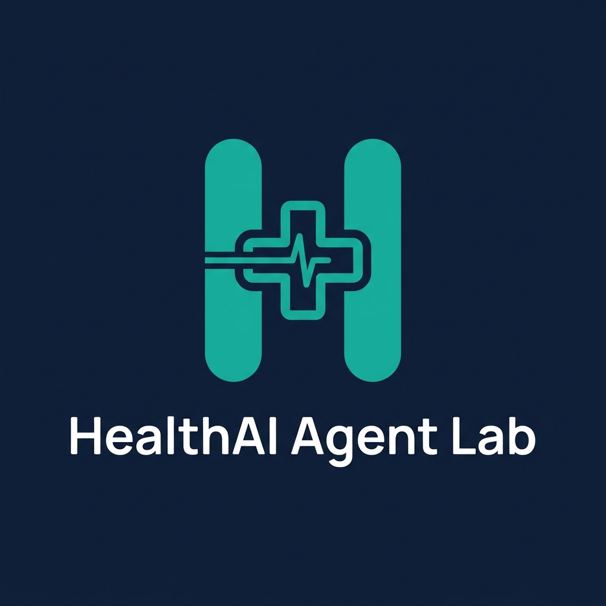
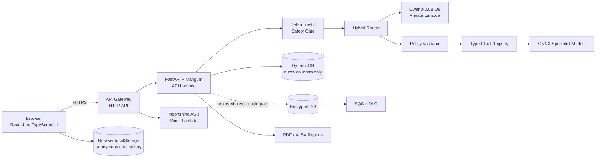
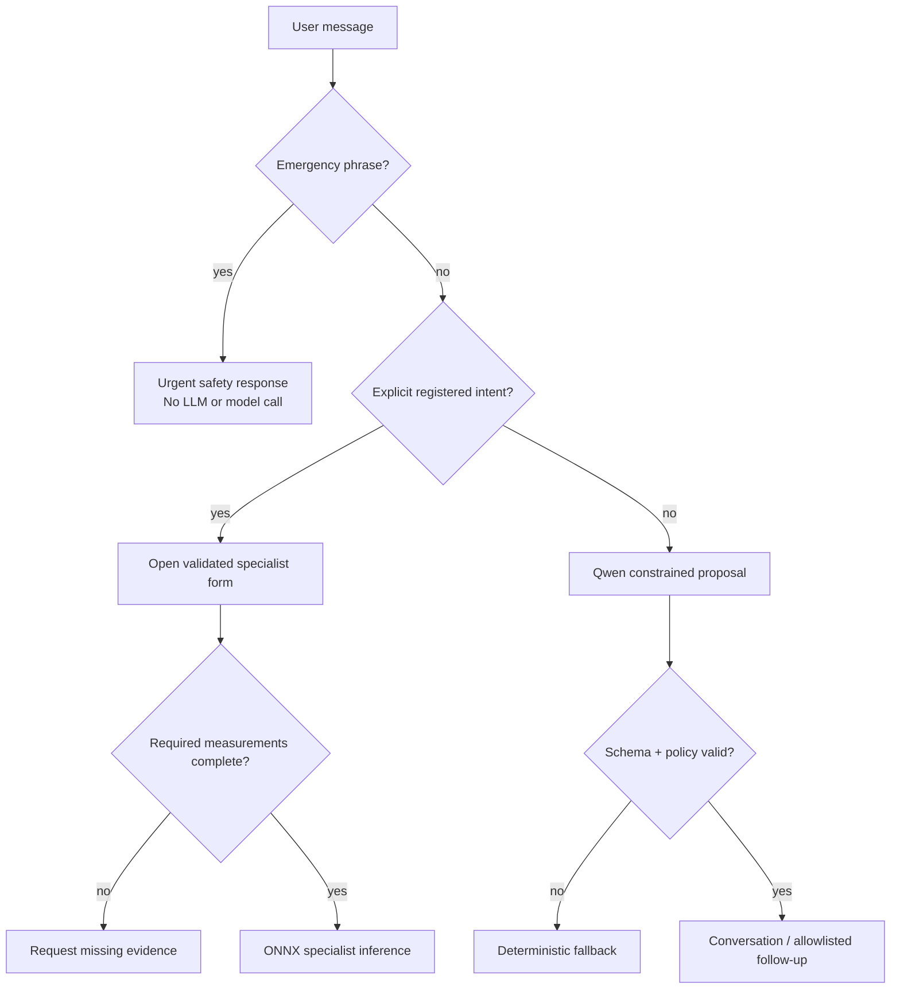
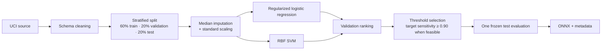

<p align="center">
  
</p>

<h1 align="center">HealthAI Agent Lab</h1>

<p align="center">
  A safety-first, agentic health-screening research system built with open models,<br />
  reproducible specialist ML, local voice inference, and a scale-to-zero AWS architecture.
</p>

<p align="center">
  <a href="https://iwbtmq43g4.execute-api.eu-north-1.amazonaws.com/"><strong>Open the live AWS demo →</strong></a>
</p>

<p align="center">
  
  
  
  
  
  
</p>

> [!IMPORTANT]
> HealthAI is an educational engineering and research demonstration—not a medical device. It does not diagnose, prescribe treatment, or replace a qualified clinician. Its deterministic safety gate can identify configured emergency phrases, but it cannot guarantee that every urgent condition will be recognized.

## Why this project exists

HealthAI explores a practical question: **how can an agentic health-research system remain private, auditable, inexpensive, and useful without outsourcing its intelligence to a hosted AI API?**

The project uses open-weight models because the inference boundary matters. Model weights run on infrastructure controlled by the project, prompts and transcripts are not sent to a third-party AI provider, model versions can be pinned, and behavior can be evaluated against a stable release. This creates an inspectable engineering system rather than a thin interface around an external API.

It also avoids asking one general-purpose LLM to solve every problem. Different parts of the workflow have different evidence and reliability requirements:

| Layer | Model or mechanism | Why it owns this responsibility |
|---|---|---|
| Conversation | **HealthAI Reasoner 1.0** · powered by Qwen3-0.6B Q8 | A small open-weight LLM is sufficient for natural language, follow-up selection, and constrained JSON proposals while remaining CPU-deployable. |
| Voice | **HealthAI Voice 1.0** · powered by Moonshine Tiny Streaming English 34M | A focused open speech model provides private transcription without the cost or data boundary of a hosted voice API. |
| Research screening | **Compact ONNX specialist models** | Structured health measurements benefit from reproducible, versioned estimators with explicit features, thresholds, and evaluation metadata. |
| Safety and authorization | **Deterministic policy** | Emergency precedence, tool permissions, schema validation, and fail-closed behavior must not depend on generated prose. |
| Anonymous continuity | **Browser-held state** | A useful session can survive refresh without requiring an account or creating a server-side clinical chat database. |

This is why the system combines a small LLM with smaller research models instead of choosing between them. Qwen interprets language; specialist models estimate only the narrow outcomes they were trained for; deterministic code decides what is allowed to run. Each model is replaceable behind a typed boundary and must earn promotion through evaluation.

### Open-weight by design

- **No external AI API keys:** conversational, speech, and specialist inference run locally or inside the project’s AWS account.
- **Version control over behavior:** exact model families, quantization, tool contracts, prompts, thresholds, and evaluation cases are visible in the repository.
- **Cost proportional to usage:** compact CPU-oriented models fit scale-to-zero Lambda functions instead of requiring an always-on GPU endpoint.
- **Research flexibility:** LoRA experiments, alternative specialist estimators, quantization, and routing policies can be tested without waiting for a hosted provider to expose them.
- **Reduced vendor coupling:** Qwen, Moonshine, and ONNX tools communicate through project-owned interfaces and can be independently upgraded or replaced.
- **Stronger privacy boundary:** health-related text and audio do not need to leave the controlled runtime for model inference.

Open weights do not automatically make a model safe, clinically valid, or unbiased. HealthAI pairs them with provenance, bounded tool access, reproducible evaluation, explicit limitations, and deterministic safety controls. That combination—not model ownership alone—is the project’s core engineering thesis.

## Model identity and releases

Every model follows one durable public naming system: **`HealthAI <Capability> <major.minor>`**. The friendly name is used throughout the UI and reports; a machine-readable release ID such as `healthai-cardio-v2.0.0` travels in API responses and provenance. Stable API slugs such as `heart` and `heart_risk` do not change when a model is upgraded.

| Public model | Technical release | Powered by / trained on | Current gate |
|---|---|---|---|
| **HealthAI Cardio 2.0** | `healthai-cardio-v2.0.0` | UCI Statlog Heart · selected ONNX pipeline | Research |
| **HealthAI Glyco 2.0** | `healthai-glyco-v2.0.0` | UCI Early Stage Diabetes · selected ONNX pipeline | Research |
| **HealthAI Renal 2.0** | `healthai-renal-v2.0.0` | UCI Chronic Kidney Disease · selected ONNX pipeline | Research |
| **HealthAI Hepatic 2.0** | `healthai-hepatic-v2.0.0` | UCI Indian Liver Patient · selected ONNX pipeline | Research |
| **HealthAI PulmoVision 1.0** | `healthai-pulmovision-v1.0.0` | PneumoniaMNIST · logistic ONNX baseline | Experimental research |
| **HealthAI Reasoner 1.0** | `healthai-reasoner-v1.0.0` | Qwen3-0.6B Q8 · llama.cpp | Hybrid runtime; LoRA 1.1 remains a candidate |
| **HealthAI Voice 1.0** | `healthai-voice-v1.0.0` | Moonshine Tiny Streaming English 34M | English ASR |
| **HealthAI Neuro 0.1** | `healthai-neuro-v0.1.0` | Retired legacy artifact | Blocked; provenance only |

Release increments have explicit meaning:

- **Major** — an incompatible dataset, feature schema, model family, or input/output contract change.
- **Minor** — compatible retraining, recalibration, threshold change, or promoted adapter with new measured behavior.
- **Patch** — packaging, metadata, conversion, or runtime correction expected to preserve predictions.

Research status is not encoded into the model name. `research`, `experimental`, `candidate`, and `blocked` are independent registry gates, so a polished version label can never be mistaken for clinical validation. Open-model attribution is also mandatory: HealthAI owns the orchestration and release contract, while Qwen and Moonshine remain visibly credited as the underlying open-weight models.

## Experience map

| Capability | What the user experiences | Implementation |
|---|---|---|
| Natural-language intake | Text or voice conversation in English/Hindi | Qwen3-0.6B proposal layer + deterministic fallback |
| Immediate specialist routing | Explicit heart, diabetes, kidney, or liver requests open the relevant assessment without a long interview | Allowlisted intent router and typed tool registry |
| General symptom intake | Bounded follow-up questions for concerns such as fever, cough, or reflux | Stateful symptom protocol with repetition protection |
| Medical voice AI | Animated recorder, editable transcript, explicit confirmation | Moonshine Tiny Streaming English, 34M parameters |
| Research screening | Validated schema, ONNX inference, calibrated threshold, provenance | Heart, diabetes, kidney, and liver pipelines |
| Image research | Chest X-ray upload and experimental pneumonia score | PneumoniaMNIST baseline; pediatric 28×28 benchmark only |
| Exportable result | Branded health-style report in PDF or XLSX | Server-generated report bound to a short-lived token |
| Anonymous memory | Chat survives refresh; Clear history removes it | Browser `localStorage`, no account required |
| Abuse controls | Friendly rate-limit response and retry window | Opaque cookie + DynamoDB TTL counters |
| Safety | Emergency phrases bypass the LLM and all prediction models | Deterministic pre-routing safety gate |

## Architecture



### Runtime components

| Component | Technology | Operational posture |
|---|---|---|
| Web application | TypeScript 5.7, Vite 6 | Compiled and served by the API Lambda |
| API | Python 3.12, FastAPI, Mangum | x86_64 Lambda, 2 GB, 30-second timeout |
| Language model | Qwen3-0.6B GGUF Q8, llama.cpp | Private x86_64 Lambda, 3,008 MB, scale-to-zero |
| Voice model | Moonshine Tiny Streaming English 34M | Private x86_64 Lambda, 3,008 MB, scale-to-zero |
| Tabular inference | ONNX Runtime | Runs inside the API Lambda on CPU |
| Quotas | DynamoDB on-demand + TTL | Stores opaque counters, never chat or clinical text |
| Temporary audio foundation | S3 + SQS + DLQ | Encrypted, one-day lifecycle; reserved for async ASR work |
| Observability | JSON CloudWatch logs + X-Ray | API logs 14 days; Qwen/voice logs 7 days |
| Infrastructure | AWS SAM / CloudFormation | Reproducible templates in `infrastructure/` |

## Request workflows

<details>
<summary><strong>1. Text conversation and orchestration</strong></summary>

1. The browser restores the anonymous conversation from local storage.
2. The deterministic safety gate checks the new message before any model call.
3. A clear registered-model request is routed directly to its specialist form.
4. Otherwise Qwen proposes a conversational response, evidence fields, or an allowlisted follow-up question.
5. The policy layer rejects unknown tools, invented fields, incomplete calls, and invalid state transitions.
6. A deterministic router takes over when Qwen is unavailable, slow, malformed, or outside policy.
7. The browser persists the sanitized conversation and encrypted state token.

The animated “thinking” state exposes operational stages such as safety review and tool routing. It does not expose hidden chain-of-thought.
</details>

<details>
<summary><strong>2. Specialist prediction</strong></summary>

1. The UI obtains the model schema from the registry.
2. The user supplies the required measurements.
3. Pydantic and tool-specific validation reject missing, unknown, or implausible fields.
4. The corresponding versioned ONNX pipeline performs CPU inference.
5. The API applies the validation-selected threshold and returns a research risk signal with provenance and limitations.
6. A 30-minute signed report token authorizes PDF/XLSX export without storing the assessment server-side.
</details>

<details>
<summary><strong>3. Medical voice intake</strong></summary>

1. The browser captures audio and sends a bounded 16 kHz mono WAV file.
2. Moonshine transcribes it on the project’s own compute.
3. The transcript is placed in the composer for user review.
4. Only the confirmed text enters the triage workflow.

The current endpoint is synchronous. The encrypted S3/SQS resources provide a future path for long or asynchronous jobs; the application does not claim that path is active today.
</details>

<details>
<summary><strong>4. Anonymous memory and rate limiting</strong></summary>

- The UI stores at most 60 messages, locale, current workflow state, and the latest triage result under `healthai.chat.v1`.
- “Clear history” removes that browser record.
- Server conversation state is AES-GCM encrypted and returned to the browser; production tokens expire after seven days.
- An opaque HttpOnly, Secure, SameSite=Lax cookie identifies a quota bucket. A privacy-preserving fallback is derived from network/user-agent signals with an application secret.
- DynamoDB keys are hashed and expire automatically. The table never contains the message body or medical inputs.
</details>

## Agentic orchestration

### Why not use Qwen for everything?

Small LLMs are valuable for language ambiguity and inexpensive CPU inference, but numerical screening and safety enforcement need reproducibility. Letting Qwen calculate every result would make outputs harder to audit and easier to prompt-inject. HealthAI therefore uses a hybrid controller:



The orchestration contract permits only known modes and registered tools. The system reconciles Qwen output against exact evidence and never treats free-form generated prose as a model invocation.

### Current tool surface

- `heart_risk` — 13 structured inputs
- `diabetes_risk` — 16 structured inputs
- `kidney_risk` — 24 structured inputs
- `liver_risk` — 10 structured inputs
- `symptom_interview` — bounded general-intake protocol
- `wellness_guidance` — non-diagnostic general information
- `pneumonia_image` — experimental pediatric benchmark route
- `skin_image` — planned and deliberately unavailable until a suitable evaluated artifact exists

The registry returns capability status at runtime, so an unavailable artifact cannot silently become an active tool.

## Model training

All shipped specialist artifacts are compact ONNX pipelines committed with machine-readable metadata. Training code lives in `backend/training/`, downloads the documented public datasets, and rebuilds each runtime artifact from source rather than relying on opaque serialized models.

### Dataset provenance

| Model | Dataset | Samples | Source/license |
|---|---:|---:|---|
| Heart | UCI Heart Disease | 270 | DOI `10.24432/C57303`, CC BY 4.0 |
| Diabetes | UCI Early Stage Diabetes Risk Prediction | 520 | DOI `10.24432/C5VG8H`, CC BY 4.0 |
| Kidney | UCI Chronic Kidney Disease | 400 | DOI `10.24432/C5G020`, CC BY 4.0 |
| Liver | UCI ILPD | 583 | DOI `10.24432/C5D02C`, CC BY 4.0 |
| Pneumonia | MedMNIST PneumoniaMNIST | 5,856 | DOI `10.5281/zenodo.10519652`, CC BY 4.0 |

The pneumonia downloader verifies the published MD5 checksum and preserves the official split. Review `backend/training/README.md` for complete feature mappings and commands.

### Reproducible tabular protocol



- Fixed seed: `44`
- Candidate ranking: higher AUROC and AUPRC, then lower Brier score
- Threshold selection: validation set only
- Final metrics: frozen test split only
- Runtime artifact: preprocessing and estimator exported together to ONNX

Train everything with:

```bash
make train
```

### Current frozen-test results

| Model | Test n | AUROC | AUPRC | Sensitivity | Specificity | Brier |
|---|---:|---:|---:|---:|---:|---:|
| Diabetes v2 | 104 | 0.9965 | 0.9978 | 0.9375 | 0.9750 | 0.0272 |
| Heart v2 | 54 | 0.8792 | 0.8376 | 1.0000 | 0.3667 | 0.1408 |
| Kidney v2 | 80 | 1.0000 | 1.0000 | 0.9000 | 1.0000 | 0.0118 |
| Liver v2 | 117 | 0.7548 | 0.8880 | 0.8675 | 0.3824 | 0.2022 |
| Pneumonia v2 | 624 | 0.9267 | 0.9264 | 0.9359 | 0.7949 | 0.1029 |

> [!CAUTION]
> These are small public benchmark results, not prospective or external clinical validation. Heart and liver specificity is currently weak. The perfect kidney discrimination may reflect dataset/source structure and must not be generalized. PneumoniaMNIST is a pediatric 28×28 benchmark and is not a production radiology model.

## Qwen fine-tuning

The repository contains an MLX LoRA experiment for the orchestration contract. Fine-tuning is intentionally isolated from API dependencies and is treated as a promotion candidate, never an automatic replacement.

### Objective

Teach Qwen3-0.6B to emit evidence-bound JSON for:

- conversation responses;
- registered tool selection;
- exact field extraction;
- allowlisted symptom questions;
- safe fallback modes.

It is **not** trained to diagnose disease or replace the specialist ONNX models.

### Configuration

| Setting | Value |
|---|---|
| Base model | `Qwen/Qwen3-0.6B` |
| Method | LoRA on query/value projections |
| Rank / scale / dropout | 8 / 16 / 0.05 |
| Layers | 12 |
| Sequence length | 1,024 |
| Batch / gradient accumulation | 1 / 4 |
| Learning rate | `1e-5` |
| Iterations | 250 |
| Prompt loss | Masked |
| Seed | 44 |

```bash
make install-qwen-training
make build-qwen-data
make finetune-qwen
make eval-qwen-adapter
```

Current versioned data contains 84 training, 3 validation, and 2 test conversations derived from 17 authored examples. That scale is suitable for demonstrating a controlled experiment, not for claiming broad medical reasoning.

### Promotion evidence

- Untuned Qwen direct routing: **30%** on the focused regression set.
- Hybrid system: **100%** on the same 10 scenarios, with a **100% policy pass rate**.
- First 55-example adapter: **60%**, but failed contract/evidence checks—rejected.
- Second 75-example adapter: **50% direct**, with 100% contract/evidence compliance—still not promoted.

The adapters remain ignored because they are generated experiments. The production design keeps the deterministic hybrid until a candidate improves task accuracy without regressing safety, evidence fidelity, or latency. See `backend/finetuning/README.md` for the experiment log.

## Repository map

```text
AI-disease-prediction/
├── backend/
│   ├── app/             # API, safety, routing, tools, reports, voice
│   ├── artifacts/       # Versioned ONNX models + metadata
│   ├── evaluation/      # Agent and Qwen regression scenarios
│   ├── finetuning/      # MLX LoRA data, config, evaluation
│   ├── tests/           # API, safety, routing, reports, security
│   └── training/        # Reproducible dataset-to-ONNX pipelines
├── frontend/
│   ├── public/          # Brand assets
│   └── src/             # TypeScript application and design system
├── infrastructure/
│   ├── template.yaml    # Serverless application
│   └── budget.template.yaml
├── Makefile
└── pyproject.toml
```

The repository contains one coherent architecture and one AWS deployment path. Generated caches, local environments, experimental adapters, compiled frontend assets, and user-provided media are excluded from version control. CI is intentionally not configured; the documented quality gates run locally before a reviewed push.

## Local development

### Prerequisites

- Python 3.12
- Node.js 20.19 or newer
- Docker Desktop (only for local Qwen)
- AWS SAM CLI (only for infrastructure validation/deployment)

### Install and validate

```bash
make install
make test
make eval
```

Run the API and frontend in separate terminals:

```bash
make dev-api
make dev-web
```

- UI: `http://127.0.0.1:5173/#assessment`
- API: `http://127.0.0.1:8000`
- Interactive API docs: `http://127.0.0.1:8000/docs`

### Enable local voice

```bash
make install-voice
make dev-api-voice
```

The model cache is stored in ignored `.moonshine-cache/` and audio stays on the machine running the API.

### Enable local Qwen

```bash
make install-qwen
make dev-api-agentic
make eval-qwen
```

Docker Model Runner exposes the private local inference endpoint. If it is unavailable, the hybrid router fails over to deterministic rules.

## API surface

| Method | Endpoint | Purpose |
|---|---|---|
| `GET` | `/health` | Service, voice, and orchestrator status |
| `GET` | `/api/v1/models` | Versioned specialist-model catalog |
| `GET` | `/api/v1/tools` | Full tool registry and safety posture |
| `POST` | `/api/v1/triage/start` | Start encrypted conversational state |
| `POST` | `/api/v1/triage/message` | Continue a bounded intake session |
| `POST` | `/api/v1/assessments/{condition}/predict` | Validated ONNX inference |
| `POST` | `/api/v1/images/pneumonia/predict` | Experimental image baseline |
| `POST` | `/api/v1/voice/transcribe` | Private Moonshine transcription |
| `POST` | `/api/v1/reports/pdf` | Generate a branded PDF |
| `POST` | `/api/v1/reports/xlsx` | Generate a structured workbook |

## Configuration

All settings use the `HEALTHAI_` prefix.

| Variable | Default | Purpose |
|---|---|---|
| `HEALTHAI_ENVIRONMENT` | `development` | Controls secure production behavior |
| `HEALTHAI_STATE_SECRET` | development-only value | AES-GCM state and quota derivation secret; use 32+ random characters in production |
| `HEALTHAI_ALLOWED_ORIGINS` | local origins | Comma-separated CORS allowlist |
| `HEALTHAI_ORCHESTRATOR_BACKEND` | `auto` | `auto`, `qwen`, or `rules` routing posture |
| `HEALTHAI_QWEN_LAMBDA_FUNCTION` | empty | Private Qwen Lambda name in AWS |
| `HEALTHAI_QWEN_BASE_URL` | local model runner | Local OpenAI-compatible model endpoint |
| `HEALTHAI_VOICE_ENABLED` | `false` | Enables the voice route/runtime |
| `HEALTHAI_MOONSHINE_CACHE_DIR` | local cache | Moonshine model directory |
| `HEALTHAI_QUOTA_TABLE` | empty | DynamoDB rate-limit table in AWS |

Never commit a production state secret. Reuse the same secret across deployments if existing encrypted browser sessions should remain valid.

## Privacy, security, and limits

- No OpenAI, Anthropic, hosted speech, or other third-party AI key is required.
- Browser chat history is local and user-clearable.
- Server-side conversation context is encrypted, authenticated, short-lived, and held by the browser.
- DynamoDB receives hashed quota keys and counters only.
- Uploaded audio and images are size/type bounded.
- Assessment payloads reject unknown fields.
- Model calls are constrained by a typed registry and policy validator.
- Emergency routing runs before Qwen or ONNX inference.
- Production cookies are HttpOnly, Secure, and SameSite=Lax.

Default quota windows:

| Route group | Limit |
|---|---:|
| Chat | 30 requests/minute |
| Voice and image | 8 requests/5 minutes |
| Model and report | 20 requests/5 minutes |
| Other API writes | 30 requests/minute |

These controls mitigate casual abuse; cookie-based anonymous rate limiting is not a substitute for authenticated quotas or a WAF in a public high-traffic product.

## AWS deployment

Production currently runs in `eu-north-1` at:

**[https://iwbtmq43g4.execute-api.eu-north-1.amazonaws.com/](https://iwbtmq43g4.execute-api.eu-north-1.amazonaws.com/)**

The design uses on-demand and scale-to-zero resources for a low-traffic portfolio workload. It avoids an always-on GPU and targets a **USD 20/month** guardrail, although a Budget alert is not a hard spending cap.

### Validate and build

```bash
make test
make validate-infra
make build-web
sam build --template-file infrastructure/template.yaml
```

On Apple Silicon, build Lambda container images for `linux/amd64` because the functions are x86_64.

### Deploy the application

```bash
export HEALTHAI_STATE_SECRET="$(openssl rand -hex 32)"

sam deploy \
  --template-file .aws-sam/build/template.yaml \
  --stack-name healthai-production \
  --region eu-north-1 \
  --profile healthai-eu-north-1 \
  --capabilities CAPABILITY_IAM \
  --resolve-image-repos \
  --resolve-s3 \
  --parameter-overrides \
    Environment=production \
    StateSecret="$HEALTHAI_STATE_SECRET" \
    AllowedOrigin='*'
```

### Deploy the budget guardrail

AWS Budgets is deployed from `us-east-1`:

```bash
sam deploy \
  --template-file infrastructure/budget.template.yaml \
  --stack-name healthai-production-budget \
  --region us-east-1 \
  --profile healthai-eu-north-1 \
  --parameter-overrides \
    MonthlyBudgetUsd=20 \
    BudgetEmail=you@example.com
```

The template sends a forecast alert at 60% and an actual-spend alert at 90%. Use a real monitored address when deploying.

### Smoke test

```bash
curl -fsS https://iwbtmq43g4.execute-api.eu-north-1.amazonaws.com/health
curl -fsS https://iwbtmq43g4.execute-api.eu-north-1.amazonaws.com/api/v1/tools
```

## Evaluation and quality gates

```bash
make test              # Ruff + Pytest + production frontend build
make eval              # deterministic/hybrid agent scenarios
make eval-qwen         # live Qwen contract and routing scenarios
make eval-qwen-adapter # candidate LoRA promotion evaluation
make validate-infra    # SAM/CloudFormation linting
```

Backend tests cover API contracts, safety precedence, routing, repetition prevention, model validation, reports, token security, and rate limiting. Evaluation scenarios are deliberately separate from unit tests so model behavior can be measured rather than asserted through mocked prose.

## Cost model

The primary cost strategy is **no idle compute**:

- API, voice, and Qwen Lambdas scale to zero.
- Qwen3-0.6B Q8 and Moonshine 34M fit CPU-oriented functions; no continuously running GPU is required.
- DynamoDB is on-demand.
- Temporary S3 objects expire after one day.
- CloudWatch retention is bounded.
- A monthly AWS Budget provides early warning.

Cold starts are the trade-off. Qwen can spend roughly 25 seconds loading its GGUF on a cold invocation, while warm requests are faster. For a portfolio workload this is preferable to paying for an idle instance; a real user-facing service would benchmark provisioned concurrency, quantization, streaming, and stricter latency SLOs.

## Known limitations and roadmap

- Expand Qwen fine-tuning data and maintain a genuinely held-out adversarial set.
- Add external, subgroup, calibration, and drift validation before any clinical claim.
- Improve heart/liver specificity and investigate kidney dataset leakage/source effects.
- Replace the PneumoniaMNIST demonstration with an appropriately governed imaging pipeline—or remove it from a clinical-facing product.
- Extend multilingual ASR beyond the current English Moonshine model.
- Add authenticated longitudinal records only with explicit consent, encryption, retention policy, and regulatory review.
- Add WAF/API Gateway usage plans if public traffic grows.
- Validate accessibility with automated and assistive-technology testing.
- Add a reviewed CI workflow only when repository secrets and branch protections are intentionally configured.

## Responsible use

Do not use this software to make a diagnosis, determine treatment, assess an emergency, or process identifiable patient data. Dataset licenses permit research reuse, but deployment in a healthcare context requires independent clinical validation, privacy/security review, bias analysis, monitoring, incident response, and compliance work appropriate to the jurisdiction.

---

<p align="center">
  <strong>HealthAI Agent Lab</strong><br />
  Open-model orchestration · deterministic safety · reproducible ML · cost-aware AWS
</p>
